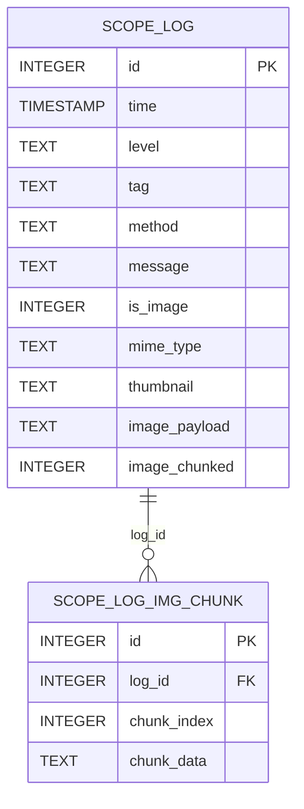

# LoggerX Log API Reference

## 1. 概览

本文档覆盖 `logs` 模块中 `LoggerX` 与 `LogDbManager` 的全部公开 API，
并说明日志数据库表结构、字段关系、导出分享链路以及常见问题排查方式。

当前版本已移除文件落盘日志写入，日志持久化仅通过 SQLite 完成，
导出能力统一为“数据库读取 -> 临时 CSV/TXT -> 系统分享面板”。

## 2. LoggerX Public API

### 2.1 字段常量

| 常量名 | 类型 | 说明 |
| --- | --- | --- |
| `COLUMN_ID` | `String` | 日志主键字段名 (`id`) |
| `COLUMN_TIME` | `String` | 时间字段名 (`time`) |
| `COLUMN_LEVEL` | `String` | 日志级别字段名 (`level`) |
| `COLUMN_TAG` | `String` | 类标签字段名 (`tag`) |
| `COLUMN_METHOD` | `String` | 方法名字段名 (`method`) |
| `COLUMN_MESSAGE` | `String` | 日志文本字段名 (`message`) |
| `COLUMN_IS_IMAGE` | `String` | 是否图片日志 (`is_image`) |
| `COLUMN_MIME_TYPE` | `String` | 图片 MIME 类型 (`mime_type`) |
| `COLUMN_THUMBNAIL` | `String` | 缩略图 Base64 (`thumbnail`) |
| `COLUMN_IMAGE_PAYLOAD` | `String` | 图片内容 Base64 (`image_payload`) |
| `COLUMN_IMAGE_CHUNKED` | `String` | 是否分片存储 (`image_chunked`) |

### 2.2 预置 Scope

| 属性 | 类型 | 说明 |
| --- | --- | --- |
| `COMMON` | `LogScopeProxy` | 通用日志域 |
| `IMPORTANT` | `LogScopeProxy` | 重要日志域 |
| `KERNEL` | `LogScopeProxy` | 核心日志域 |
| `ERROR` | `LogScopeProxy` | 错误日志域 |

### 2.3 方法列表

#### `registerScope(logInterceptor: LogInterceptor, vararg scopes: LogScope): Unit`

- 参数:
  - `logInterceptor`: 作用域拦截策略。
  - `scopes`: 需注册的自定义作用域集合。
- 返回值: `Unit`。
- 异常:
  - 无显式抛出；若注册后的调用访问未注册 scope，后续会在内部抛
    `IllegalArgumentException`。

#### `createScope(customScope: String): LogScopeProxy`

- 参数:
  - `customScope`: 自定义作用域名称。
- 返回值: `LogScopeProxy`。
- 异常:
  - `IllegalArgumentException`: `customScope` 为空或仅空白字符时触发。

#### `init(context: Context, outputConfig: OutputConfig = OutputConfig()): Unit`

- 参数:
  - `context`: 初始化上下文，要求为 `Application`。
  - `outputConfig`: 输出配置（当前仅控制是否 Logcat 输出与数据库写入）。
- 返回值: `Unit`。
- 异常:
  - `ClassCastException`: 传入 `Context` 不是 `Application` 时可能触发。

#### `getScopes(): List<String>`

- 参数: 无。
- 返回值: 当前已注册的 scope 名称列表。
- 异常: 无显式抛出。

#### `getOutputters(): List<LogOutputter>`

- 参数: 无。
- 返回值: 当前输出器列表。
- 异常: 无显式抛出。

#### `clear(): Boolean`

- 参数: 无。
- 返回值:
  - `true`: 清空全部日志表成功。
  - `false`: 清理过程中出现异常。
- 异常: 内部捕获异常并返回 `false`。

#### `exportAndShareAll(exportAll: Boolean = true, limit: Int = 1000, format: LogExportManager.ExportFormat = LogExportManager.ExportFormat.CSV, onProgress: ((Int) -> Unit)? = null): Unit`

- 参数:
  - `exportAll`: `true` 时导出所有记录，`false` 时按 `limit` 导出。
  - `limit`: 每个 scope 导出上限。
  - `format`: 导出格式，支持 `CSV` 与 `TXT`。
  - `onProgress`: 总体进度回调，范围 `0..100`。
- 返回值: `Unit`（异步执行）。
- 异常: 无显式抛出，内部失败时跳过对应文件。

#### `getDbFileSize(): Double`

- 参数: 无。
- 返回值: 数据库文件大小（MB）。
- 异常: 无显式抛出。

#### `enableAutoClean(retentionDays: Int): Unit`

- 参数:
  - `retentionDays`: 保留天数，`<= 0` 时忽略。
- 返回值: `Unit`。
- 异常: 定时任务内部异常会被捕获并记录日志。

#### `enableAutoClean(maxSizeMb: Double, cleanSizeMb: Double): Unit`

- 参数:
  - `maxSizeMb`: 数据库最大允许大小（MB）。
  - `cleanSizeMb`: 每轮清理目标压缩量（MB）。
- 返回值: `Unit`。
- 异常: 定时任务内部异常会被捕获并记录日志。

## 3. LogDbManager Public API

### 3.1 数据类

#### `ImagePreviewData(mimeType: String, thumbnailBase64: String?, compressedBase64: String?)`

- 字段说明:
  - `mimeType`: 图片 MIME 类型。
  - `thumbnailBase64`: 缩略图 Base64。
  - `compressedBase64`: 压缩图 Base64（可能来自分片拼接）。

### 3.2 方法列表

#### `getDbFileSize(): Double`

- 参数: 无。
- 返回值: 数据库文件大小（MB）。
- 异常: 无显式抛出。

#### `insertLog(scopeTag: String, level: String, classTag: String, method: String, message: String): Unit`

- 参数:
  - `scopeTag`: 作用域标签，映射到 `<scope>_log` 表。
  - `level`: 日志级别。
  - `classTag`: 类标签。
  - `method`: 方法名。
  - `message`: 日志内容。
- 返回值: `Unit`。
- 异常:
  - 无向外抛出，内部重试 2 次后失败会记录错误日志。

#### `insertImageLog(scopeTag: String, level: String, classTag: String, method: String, message: String, mimeType: String, thumbnailBase64: String, payloadBase64: String?, chunked: Boolean, chunks: List<String>): Boolean`

- 参数:
  - `scopeTag`: 作用域标签。
  - `level`: 日志级别。
  - `classTag`: 类标签。
  - `method`: 方法名。
  - `message`: 描述信息。
  - `mimeType`: 图片 MIME 类型。
  - `thumbnailBase64`: 缩略图 Base64。
  - `payloadBase64`: 非分片模式下完整图片 Base64。
  - `chunked`: 是否分片存储。
  - `chunks`: 分片内容列表（`chunked=true` 时有效）。
- 返回值:
  - `true`: 插入成功。
  - `false`: 超出列限制或数据库写入失败。
- 异常: 内部捕获异常并返回 `false`。

#### `loadImageBase64(scopeTag: String, logId: Int): String?`

- 参数:
  - `scopeTag`: 作用域标签。
  - `logId`: 主日志 ID。
- 返回值:
  - 图片 Base64 字符串，若为分片则自动拼接。
  - 找不到、非图片或失败时返回 `null`。
- 异常: 内部捕获异常并返回 `null`。

#### `loadImagePreviewData(scopeTag: String, logId: Int): ImagePreviewData?`

- 参数:
  - `scopeTag`: 作用域标签。
  - `logId`: 主日志 ID。
- 返回值:
  - 图片预览数据对象。
  - 找不到或非图片返回 `null`。
- 异常: 内部捕获异常并回退为 `null` 或 payload 为 `null` 的对象。

#### `loadImageMimeType(scopeTag: String, logId: Int): String?`

- 参数:
  - `scopeTag`: 作用域标签。
  - `logId`: 主日志 ID。
- 返回值: 图片 MIME 类型，查不到时为 `null`。
- 异常: 内部捕获异常并返回 `null`。

#### `queryLogsAdvanced(scopeTag: String, time: String? = null, tag: String? = null, level: String? = null, method: String? = null, isImage: Boolean? = null, keyword: String? = null, isAsc: Boolean = false, page: Int = 1, limit: Int? = 100, includeImagePayload: Boolean = false): List<Map<String, Any>>`

- 参数:
  - `scopeTag`: 作用域标签。
  - `time`: 时间模糊过滤（如 `2026-03-20`）。
  - `tag`: 类标签精确过滤。
  - `level`: 日志级别精确过滤。
  - `method`: 方法名模糊过滤。
  - `isImage`: 是否仅查询图片日志。
  - `keyword`: `message` 关键字模糊过滤。
  - `isAsc`: 是否按时间升序。
  - `page`: 分页页码（从 1 开始）。
  - `limit`: 每页条数，`null` 表示不分页限制。
  - `includeImagePayload`: 是否在结果中附带 `image_payload`。
- 返回值:
  - 查询结果列表，元素为字段键值映射。
  - 查询失败返回空列表。
- 异常: 内部捕获异常并返回空列表。

#### `getDistinctValues(scopeTag: String, columnName: String): List<String>`

- 参数:
  - `scopeTag`: 作用域标签。
  - `columnName`: 去重字段名，支持 `time`/`method` 特殊清洗逻辑。
- 返回值: 去重后的字符串列表。
- 异常: 内部捕获异常并返回空列表。

#### `deleteLogs(scopeTag: String, timeFormat: String?): Int`

- 参数:
  - `scopeTag`: 作用域标签。
  - `timeFormat`: 阈值时间，格式 `yyyy-MM-dd HH:mm:ss`。
    为空时删除该 scope 全部数据。
- 返回值: 主日志表删除行数。
- 异常: 异常默认由 SQLite 层抛出（未在该方法内统一捕获）。

#### `clearAllLogs(): Boolean`

- 参数: 无。
- 返回值:
  - `true`: 清空所有 `_log` 表成功。
  - `false`: 清空失败。
- 异常: 内部捕获异常并返回 `false`。

#### `startAutoCleanByDate(retentionDays: Int): Unit`

- 参数:
  - `retentionDays`: 保留天数，`<= 0` 不启动。
- 返回值: `Unit`。
- 异常: 定时任务内部异常被捕获并记录日志。

#### `startAutoCleanBySize(maxSizeMb: Double, cleanSizeMb: Double): Unit`

- 参数:
  - `maxSizeMb`: 数据库最大允许大小（MB）。
  - `cleanSizeMb`: 每轮目标清理大小（MB）。
- 返回值: `Unit`。
- 异常: 定时任务内部异常被捕获并记录日志。

## 4. 数据表结构

### 4.1 主日志表: `<scope>_log`

每个 scope 对应一张独立主日志表，例如:
`Common_log`、`Important_log`、`Kernel_log`、`Error_log`。

| 字段名 | 类型 | 可空 | 默认值 | 主键/索引 | 说明 |
| --- | --- | --- | --- | --- | --- |
| `id` | `INTEGER` | 否 | 自增 | 主键 | 日志主键 |
| `time` | `TIMESTAMP` | 是 | `datetime('now','localtime')` | 索引成员 | 记录时间 |
| `level` | `TEXT` | 是 | 无 | - | 日志级别 |
| `tag` | `TEXT` | 是 | 无 | - | 类标签 |
| `method` | `TEXT` | 是 | 无 | - | 方法信息 |
| `message` | `TEXT` | 是 | 无 | - | 日志内容 |
| `is_image` | `INTEGER` | 是 | `0` | 索引成员 | 是否图片日志（0/1） |
| `mime_type` | `TEXT` | 是 | 无 | - | 图片 MIME |
| `thumbnail` | `TEXT` | 是 | 无 | - | 缩略图 Base64 |
| `image_payload` | `TEXT` | 是 | 无 | - | 图片正文 Base64 |
| `image_chunked` | `INTEGER` | 是 | `0` | - | 是否分片存储（0/1） |

索引:

- `idx_<scope>_log_time_image(time, is_image)`

### 4.2 图片分片表: `<scope>_log_img_chunk`

当 `image_chunked=1` 时，图片内容被拆分后写入该表。

| 字段名 | 类型 | 可空 | 默认值 | 主键/索引 | 说明 |
| --- | --- | --- | --- | --- | --- |
| `id` | `INTEGER` | 否 | 自增 | 主键 | 分片主键 |
| `log_id` | `INTEGER` | 否 | 无 | 联合索引成员 | 关联主日志 ID |
| `chunk_index` | `INTEGER` | 否 | 无 | 联合索引成员 | 分片顺序 |
| `chunk_data` | `TEXT` | 否 | 无 | - | 分片内容 |

索引:

- `idx_<scope>_log_img_chunk(log_id, chunk_index)`

外键关系说明:

- 逻辑关联为 `<scope>_log_img_chunk.log_id -> <scope>_log.id`。
- 当前实现未显式声明 SQLite `FOREIGN KEY` 约束，
  由应用层删除逻辑（`deleteLogs`/`clearAllLogs`）保障一致性。

## 5. ER 关系图



> 说明: `SCOPE_LOG` 与 `SCOPE_LOG_IMG_CHUNK` 为模板名，
> 实际表名按 scope 动态替换（如 `Common_log`、`Common_log_img_chunk`）。

## 6. 端到端示例

### 示例 1: 初始化 + 写入日志 + 图片日志

```kotlin
class App : Application() {
    override fun onCreate() {
        super.onCreate()
        LoggerX.init(this, OutputConfig(isLog = true, isWriteDatabase = true))
    }
}

fun writeSample(bitmap: Bitmap) {
    LoggerX.COMMON.i("启动完成")
    LoggerX.ERROR.e("网络异常", RuntimeException("timeout"))
    LoggerX.COMMON.image(bitmap, mimeType = "image/png", message = "截图")
}
```

### 示例 2: 按条件查询 + 去重筛选 + 图片预览读取

```kotlin
fun querySample() {
    val logs = LoggerX.COMMON.queryLogs(
        level = "INFO",
        keyword = "启动",
        page = 1,
        limit = 50
    )

    val methods = LoggerX.COMMON.getDistinctValues(LoggerX.COLUMN_METHOD)
    val firstImageId = logs.firstOrNull {
        (it[LoggerX.COLUMN_IS_IMAGE] as? Int) == 1
    }?.get(LoggerX.COLUMN_ID) as? Int

    if (firstImageId != null) {
        val preview = LoggerX.COMMON.loadImagePreviewData(firstImageId)
        println("mime=${preview?.mimeType}, hasThumb=${!preview?.thumbnailBase64.isNullOrBlank()}")
    }
}
```

### 示例 3: 数据库导出临时文件并分享

```kotlin
fun exportAndShare() {
    LoggerX.exportAndShareAll(
        exportAll = false,
        limit = 1000,
        format = LogExportManager.ExportFormat.TXT
    ) { progress ->
        println("export progress=$progress")
    }
}
```

## 7. 快速排查表

| 现象/异常 | 优先检查 API/字段 | 检查点 |
| --- | --- | --- |
| 查询结果为空 | `queryLogsAdvanced` + `scopeTag` | 是否写入到同一个 scope；`limit/page` 是否过滤过严 |
| 图片日志插入失败返回 `false` | `insertImageLog` + `thumbnail`/`image_payload` | Base64 字节长度是否超过 `MAX_TEXT_COLUMN_BYTES` |
| 图片预览为 `null` | `loadImagePreviewData` + `is_image`/`log_id` | 该 `id` 是否为图片日志，分片表是否有对应 `log_id` |
| 导出无文件分享 | `exportAndShareAll` + 查询条件 | 对应 scope 是否有数据；`limit` 是否过小导致空导出 |
| 自动清理未生效 | `startAutoCleanByDate`/`startAutoCleanBySize` | 参数是否大于 0；任务线程是否在进程内持续运行 |
| 删除后仍有分片残留 | `deleteLogs` + `log_id` | 删除时间条件是否覆盖目标行；分片表是否与 scope 对应 |

